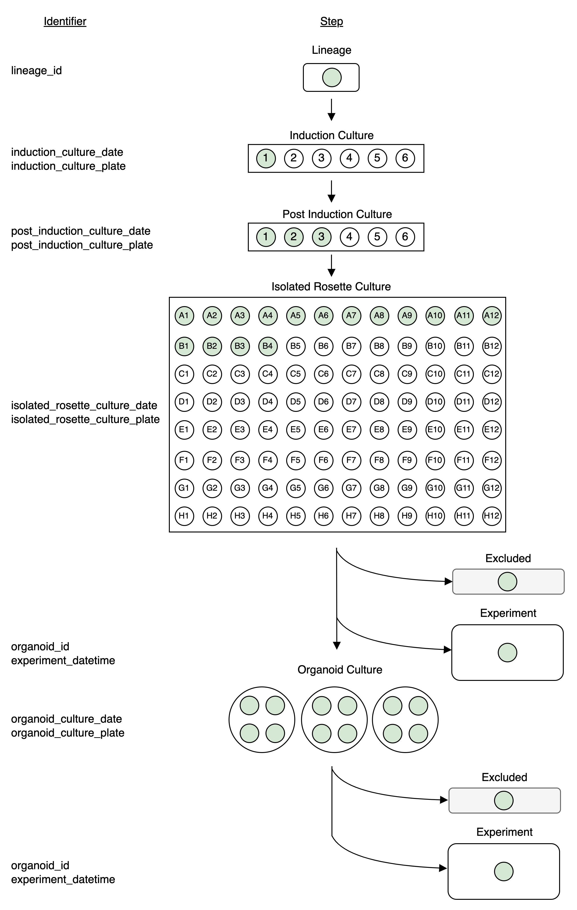

# DataJoint Workflow for Utah Lab

This is the central codebase for the **DataJoint Workflow for Utah Lab**.

The pipeline consists of several schemas and tables, covering multiple data modalities and/or DataJoint Elements.

+ Organoids Culture Diagram

+ Culture and Experiment Diagram

+ Array Ephys DataJoint Diagram

+ For more details, run the [EXPLORE_pipeline_architecture](./notebooks/EXPLORE_pipeline_architecture.ipynb) notebook.

_Ensure you have a [DataJoint Works account](https://accounts.datajoint.com/) before getting started._

## Quick Start Guide

What are you aiming to achieve with the pipeline?

| User Type         | Description                                                                                                                                                    | Relevant Notebooks     |
|-------------------|----------------------------------------------------------------------------------------------------------------------------------------------------------------|------------------------|
| **Guest**         | Explore the data without installing anything. [Learn more](./docs/README.md#getting-started-as-a-guest).                                                                        | `EXPLORE`              |
| **Experimenter**  | Quickly run the pipeline with your new experiment without spending time inspecting the code. [Learn more](./docs/README.md#getting-started-as-a-experimenter).                  | `EXPLORE`              |
| **Power-User**    | Delve deeper and run specific pipeline computations on the cloud or locally. [Learn more](./docs/README.md#getting-started-as-a-power-user).                                    | `CREATE`, `RUN`, `EXPLORE` |
| **Developer/Admin** | Maintain and add new features to the pipeline codebase. [Learn more](./docs/README.md#getting-started-as-a-developer-or-admin).                                              | `CREATE`, `RUN`, `EXPLORE` |

## SciViz website

Data viewer for the Utah Organoids DataJoint pipeline. Please use the entry forms provided on the website to manually input relevant data entries.

<https://organoids.datajoint.com/>

## Citations

+ If your work uses [SpikeInterface within the pipeline](https://github.com/datajoint/element-array-ephys/tree/datajoint-spikeinterface), cite the respective manuscript. For details, visit [here](https://spikeinterface.readthedocs.io/en/latest/references.html).
+ For other tools integrated within the pipeline, cite their respective manuscripts and Research Resource Identifiers (RRIDs).
+ For work utilizing DataJoint Python and/or Elements, cite the respective manuscripts and RRIDs. For details, visit [here](https://datajoint.com/docs/about/citation/).

DataJoint promotes integration and interoperability across neuroscience ecosystems, encouraging transparency and collaboration in research.

## Additional Resources

+ [Official documentation for DataJoint](https://datajoint.com/docs/)
+ [Interactive tutorials written in Python](https://github.com/datajoint/datajoint-tutorials)
+ [Notebook for logical operators in DataJoint tables](https://github.com/datajoint-company/db-programming-with-datajoint/blob/master/notebooks/SQL%20Syntax%20for%20DataJoint%20Querying.ipynb)
+ [DataJoint Table Tiers](https://datajoint.com/docs/core/datajoint-python/0.13/reproduce/table-tiers/)
+ [DataJoint Common Commands](https://datajoint.com/docs/core/datajoint-python/0.13/query-lang/common-commands/)
+ [DataJoint Operators](https://datajoint.com/docs/core/datajoint-python/0.13/query-lang/operators/)
+ [DataJoint Populate Function](https://datajoint.com/docs/core/datajoint-python/0.14/compute/populate/)
+ [Contribute documentation](https://datajoint.com/docs/about/contribute/)
+ [Quality assurance principles in DataJoint](https://datajoint.com/docs/elements/management/quality-assurance/)